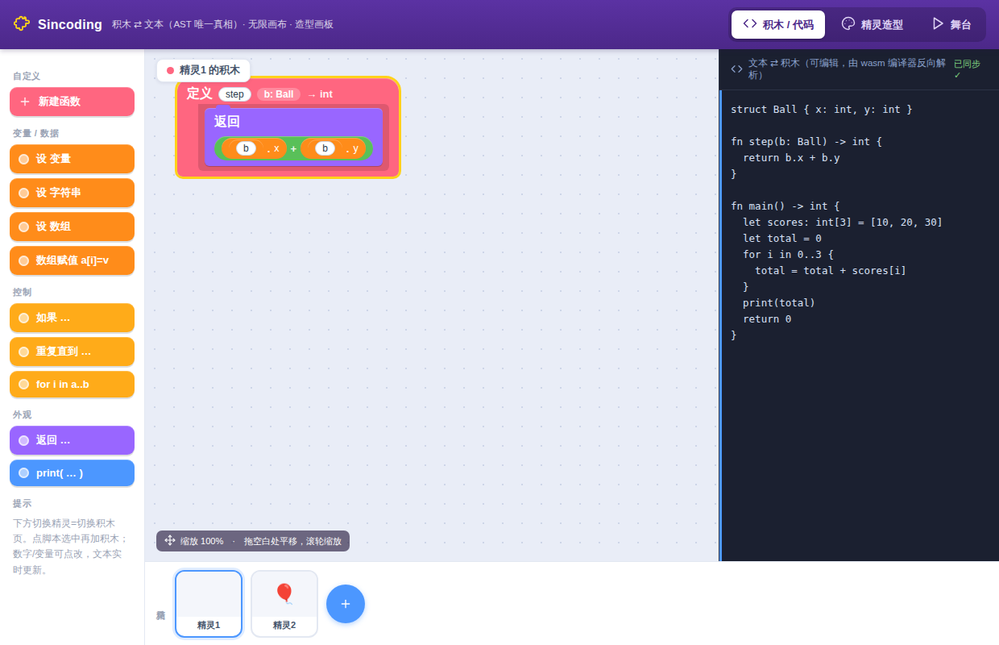
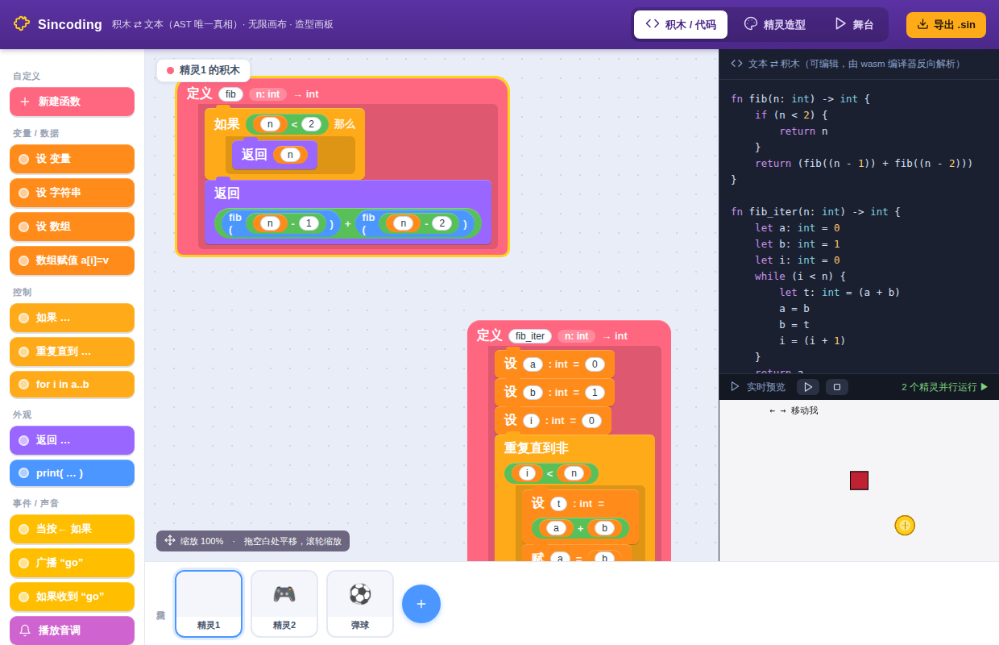
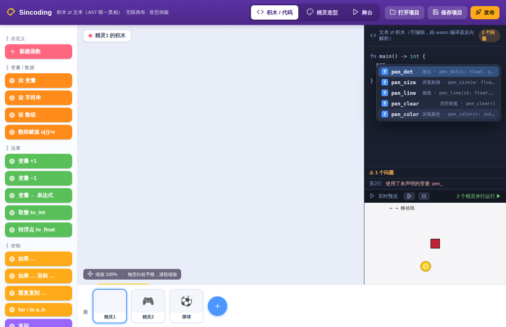
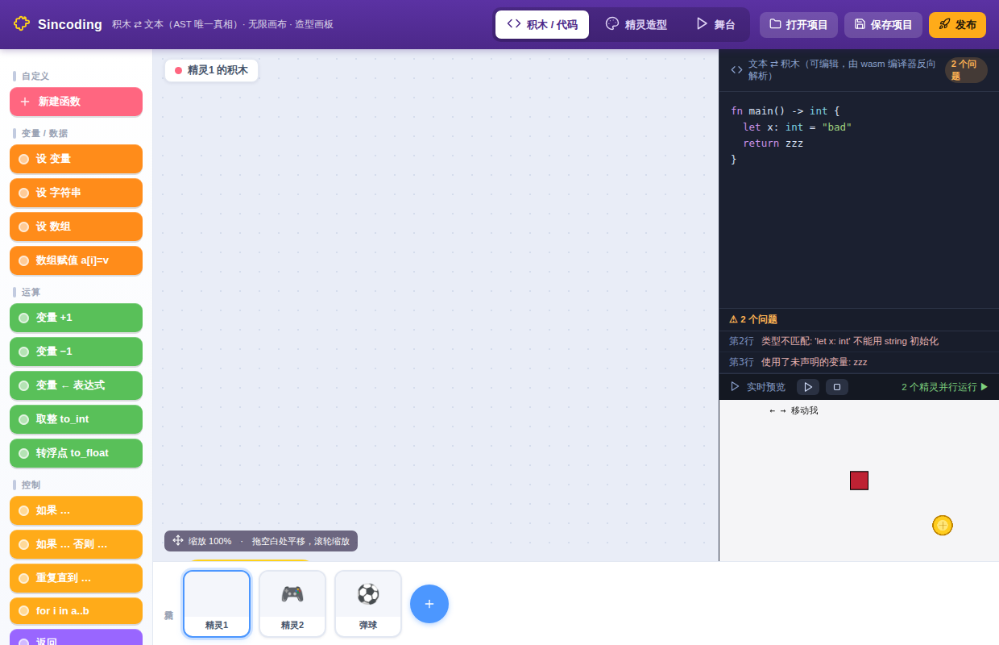
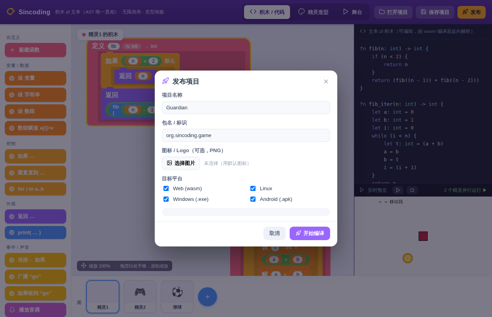
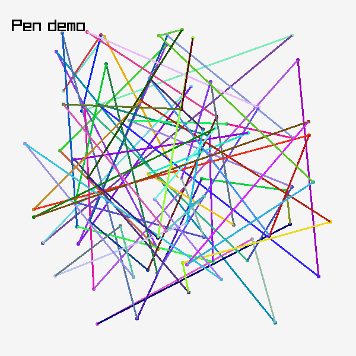
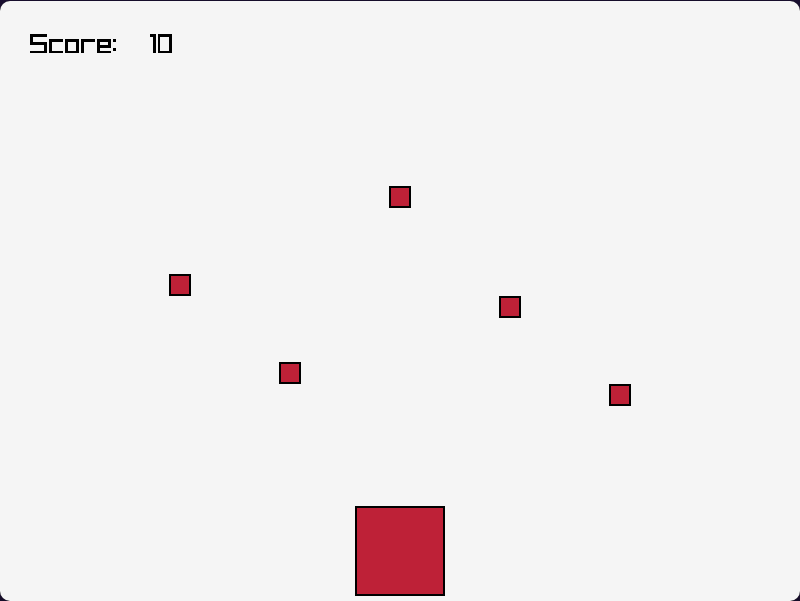
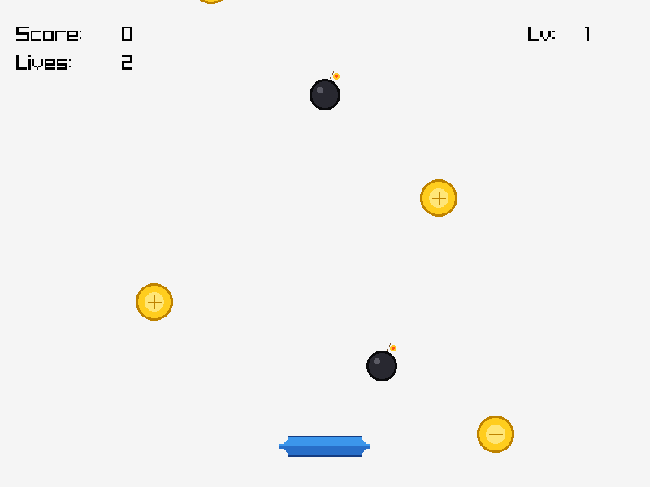

# Sincoding

类似 Scratch 的图形化编程工具：用户通过**积木**或**文本**编写程序，
程序使用自研语言（语法类似 Lua/Python），**转译为 C** 后编译为各平台原生应用。

> 完全自研 · imgui + Qt 编辑器 · raylib 运行时 · 多平台（Windows / Android / Web）

详细技术设计见 [`docs/DESIGN.md`](docs/DESIGN.md)，语言参考见 [`docs/LANGUAGE.md`](docs/LANGUAGE.md)。

---

## 当前进度

**整条技术栈已端到端打通**：一段 Sincoding 代码 → 转 C → 链接运行时 → raylib → 能用方向键移动角色的原生成品。

| 阶段 | 内容 | 状态 |
|---|---|---|
| 0 | **最小垂直切片**：语言 → C → raylib → 可运行的"方向键移动精灵"成品 | ✅ 已跑通（无头渲染验证，见下图） |
| 1 | 语言 → C 转译器（Lexer/Parser/类型检查/代码生成） | ✅ 已完成，斐波那契等用例可编译运行 |
| 2 | runtime.c 基于 raylib（舞台/精灵/输入/声音） | ✅ 运行时 + 桥接层落地，方块角色已渲染 |
| 3 | 积木编辑器接 AST（积木 ⇄ 文本双向同步） | 🚧 单页 IDE：无限画布 / 多精灵·多页积木 / 编辑写回 / **积木拖拽重排** / 造型画板 / **舞台（造型即纹理）**|
| 4 | CMake 多平台（Web → Windows → Android） | ✅ **Web(wasm) / Windows(.exe) / Android(.so) 三平台均打通**（iOS 按设计放弃） |
| 5 | JSON 桥接外部 ELF（静态 + 动态） | ✅ 静态链接 + 动态 dlopen/dlsym 均打通（含三层类型映射） |

> 设计文档的 6 个阶段（0–5）已全部落地，并各有可复现的验证（`tests/run_tests.sh`，共 48 项）。

核心设计原则：**AST 是唯一真相源**。积木是 AST 的可视化渲染，文本是 AST 的序列化。

阶段 0 成品截图（`examples/game.sin` 无头运行所得，角色为居中方块）：


积木 IDE（`editor/index.html`）：无限积木画布 + 实时文本写回（左边改积木，右边文本立即更新）：


**双向同步**：文本框也可直接编辑——把**编译器本身编成 WebAssembly**（`editor/sinc.{js,wasm}`），在浏览器里用同一个 C++ 引擎把文本解析回积木（下图：右侧改源码，左侧积木实时重建，语法错时显示"部分有效"）。积木 ⇄ 文本两个方向都走规范引擎，真正做到"AST 唯一真相"：



**实时编辑预览（类 Vue）+ 多精灵并行 + 语法高亮 + 一键导出**：右下角内置**积木解释器**，把**所有精灵并行**跑在同一舞台上（共享世界、协调清屏），编辑积木/文本即重跑；支持键盘事件、广播、声音（Web Audio）。文本框带**语法高亮**；右上角"**导出 .sin**"一键产出可独立编译的源码（自动补全运行时 `extern` 声明）。下图：左积木、右上高亮源码、右下 **2 个精灵并行运行**（键控方块已右移 + 自动弹球）：



**写代码：补全 + 实时诊断**（仿 Scratch 配色的代码视图）：输入前缀即弹**补全下拉**——
关键字 / 类型 / 运行时函数（带中文名 + 形参签名）/ 本项目标识符，↑↓ 选、Enter 接受；
编辑即由 wasm 规范引擎做**语法/类型检查**，底部诊断面板按 `第N行` 列出错误，点一条跳到该行：




**造型即外观，预览所见 = 成品所见**：`sprite_load(name)` 在预览里画出的就是**造型本身**
（上图右下的金币就是 `coin.png` 造型，而非占位图）——画板里画的造型、预览跑出的画面、
导出成品渲染的纹理，三者同一来源。预览解释器优先用同名 painted 造型，否则按文件名加载
造型 PNG，与导出成品 `sprite_load` 完全一致；程序化方块（`sprite_new`）的颜色也与运行时
`RT_SPR_RECT` 对齐。改一处造型，预览与成品一起变。

**项目级共享状态**：结构体 / 全局变量 / 数组属于**整个项目**——所有精灵共享同一组。
在任一精灵的文本里加一个全局，切到别的精灵也能看到、读写的是同一份数据，从而能用多精灵
协作搭一个完整项目。预览解释器把这些共享全局求值进一个公共作用域，各精灵 actor 的环境栈底
都指向它，因此一个精灵对共享数组/结构体的修改对其它精灵立即可见。

**保存项目 + 一键发布多平台**：顶栏「保存项目 / 打开项目」把整个工程（精灵 / 积木 / 造型 /
共享状态）存成 `.sinproj` 再打开继续干；「发布」弹模态框填**项目名 / 包名 / 图标(Logo) / 平台**，
经本地构建服务 `tools/ide_server.py` 一键交叉编译到 **Linux / Windows / Android / Web**（浏览器
不能交叉编译，真正编译由 `build_*.sh` 在本机完成），产物落在 `editor/dist/<名>/<平台>/` 并给出
下载 / 打开链接：



```bash
python3 tools/ide_server.py 8000      # 浏览器开 http://127.0.0.1:8000/index.html
# 「发布」选平台 → 一键编出 dist/<名>/{linux,windows,android,web}/ 产物
```

精灵造型画板（画笔 / 橡皮 / 调色板 / 多造型）。底部精灵栏支持**多精灵**，每个精灵是独立的**一页积木**；积木可**拖拽重排**：


舞台：精灵以其「造型」为外观/纹理（下图左为占位、右为画板里画的造型），可拖动摆位：


**画笔持久层 + 平台 API**（`examples/pen.sin`）：`pen_*` 在一张**跨帧保留**的绘制层上画线/点，
每帧贴回屏幕，笔迹不断累积；配合 `random_int` / `screen_width` 等平台 API。下图为无头跑 60 帧
所得（随机彩色线段累积成网）：



字符串接入运行时：PNG 造型经 `sprite_load` 当纹理、`say` 气泡、`draw_text` 画文字（`examples/say.sin` 无头运行）：


**完整可玩小游戏「接球」**（`examples/catch.sin`）：方向键移动挡板接住下落小球。综合用到定长数组（小球句柄与坐标）、字符串/整数文字、键盘输入与计分逻辑。下图为无头运行 60 帧所得，`Score: 2` 证明计分逻辑确实在跑：


同一个游戏编成 **WebAssembly，在浏览器里直接玩**（`web-demo/`，方向键控制；下图为浏览器中运行 4 秒所得，`Score: 10`）：



```bash
tools/build_web.sh examples/catch.sin web-demo          # 生成
python3 -m http.server 8000 --directory web-demo        # 浏览器开 http://localhost:8000
```

阶段 4：同一份 `game.sin` 转 C 后经 emscripten 编成 **WebAssembly**，在浏览器中由 raylib 渲染（最像 Scratch 的发布方式）：


阶段 4：同一份 `game.sin` 经 MinGW-w64 交叉编译出单文件 **Windows `.exe`**（下图为 Wine 中实跑，顶部黑条是 Wine 标题栏）：


---

## 快速开始

### 1. 构建编译器 `sinc`

```bash
cmake -S compiler -B compiler/build
cmake --build compiler/build -j
```

### 2. 把 Sincoding 源码转译为 C 并运行

```bash
# 转译为 C
./compiler/build/sinc examples/fib.sin -o fib.c

# 用任意 C 编译器编译运行
gcc fib.c -o fib && ./fib
# 输出:
# 55
# 55
```

也可以直接打印生成的 C（不带 `-o` 时输出到 stdout），或用 `--tokens` 查看词法结果。

### 3. 编出图形成品（需要 raylib）

通过 `extern fn` 声明的运行时函数（见 `runtime/prelude.h`），程序可以开窗口、画角色、读按键：

```bash
# 安装 raylib（Ubuntu 举例）后：
tools/build_native.sh examples/game.sin /tmp/game
/tmp/game        # 方向键移动方块角色
```

无显示器环境（CI）可无头运行并截图验证：

```bash
SIN_MAX_FRAMES=8 SIN_SCREENSHOT=shot.png \
  xvfb-run -a -s "-screen 0 800x600x24" /tmp/game
```

### 4. 跑测试

```bash
bash tests/run_tests.sh
```

端到端验证：源码 → 转译 → `gcc` 编译 → 运行 → 比对输出，并检查类型/语义错误能被正确拒绝。

---

## 语言一瞥

显式类型 + 局部类型推断，大括号风格：

```rust
fn fib(n: int) -> int {
    if n < 2 {
        return n
    }
    return fib(n - 1) + fib(n - 2)
}

fn main() -> int {
    let n = 10          // 推断为 int
    print(fib(n))       // 55
    return 0
}
```

支持：`int` / `float` / `bool` / `string`、**定长数组 `T[N]`**、**结构体**、**全局变量**、函数（含递归/互递归）、
`if/else`、`while`、**`for i in a..b`**、算术与逻辑运算、内建 `print`。完整文法见 [`docs/LANGUAGE.md`](docs/LANGUAGE.md)。

---

## 目录结构

```
compiler/        语言 → C 转译器（C++17，手写递归下降）
  include/       词法/语法/AST/类型检查/代码生成 头文件
  src/           对应实现 + sinc 命令行入口
runtime/         运行时：runtime.c（Scratch 风格，封装 raylib）
                 + prelude.c/.h（语言 ABI 桥接层，extern fn 的实现）
editor/          积木前端：单页 IDE（index.html，多精灵/多页/造型画板）
templates/       平台构建模板：web/（emscripten）、windows/（MinGW）、android/（NDK+Gradle）
tools/           build_native/web/windows/apk.sh、ide_server.py（编辑器+构建服务）、
                 make_costumes.py、render_blocks.sh / 各类验证脚本
examples/        示例 .sin 程序（hello / fib / types / game）
tests/           端到端测试与用例
docs/            技术设计、语言参考、截图
```

## 三种视图，一个 AST

文本、积木、C 代码都从同一棵 AST 派生：

```bash
sinc examples/fib.sin --emit src      # AST → 规范化 Sincoding 源码（文本视图）
sinc examples/fib.sin --emit blocks   # AST → 积木模型 JSON（积木视图）
sinc examples/fib.sin --emit c        # AST → C 代码（编译产物）
```

`--emit src` 幂等且与原程序语义等价（往返后生成的 C 完全一致），这正是积木 ⇄ 文本双向同步的正确性基础。

## 编成 Web(wasm) 成品

```bash
# 需要 emscripten（emcmake）+ raylib 的 web 静态库（/usr/local/lib/web/libraylib.a）
tools/build_web.sh examples/game.sin out_web
# wasm 不支持 file://，用 HTTP 服务器打开：
python3 -m http.server 8000 --directory out_web   # 浏览器访问 http://localhost:8000
```

由 `templates/web/`（emscripten shell + CMakeLists）经 `emcmake cmake` 构建，
主循环用 `-sASYNCIFY` 适配浏览器。

## 编成 Windows .exe（MinGW 交叉编译）

```bash
# 需要 MinGW-w64 + raylib 的 Windows 静态库（/usr/local/lib/win/libraylib.a）
tools/build_windows.sh examples/game.sin out/game.exe   # 产出单文件 PE32+ exe
```

由 `templates/windows/`（MinGW 工具链文件 + CMakeLists）交叉编译，`-static` 链接出免依赖单文件。

## 打包 Android（一键出可安装 APK）

```bash
# 需要 Android NDK + raylib(Android) 静态库 + SDK build-tools(aapt2/zipalign/apksigner) + 平台 android.jar
ANDROID_NDK=/usr/lib/android-ndk ANDROID_SDK_ROOT=/path/to/android-sdk \
  tools/build_apk.sh examples/guardian.sin dist/guardian.apk "守护者"
adb install dist/guardian.apk      # 直接装到手机
```

`tools/build_apk.sh` 全程不依赖 Gradle：`sinc` 转 C → NDK 交叉编 `libsincoding.so`
→ `aapt2 link` 产出带**二进制 Manifest** 的基础 APK → 塞入 `lib/<abi>/` → `zipalign`
→ `apksigner`（调试 keystore 按需自动生成）签名。因 `NativeActivity` + `hasCode=false`
**无需 dex**。产物经 v2/v3 签名校验通过，`aapt2 dump badging` 可见 `native-code: arm64-v8a`。

也可只产原生库再走 Gradle 壳（见 `templates/android/`）：

```bash
ANDROID_NDK=/usr/lib/android-ndk \
  tools/build_android.sh examples/game.sin templates/android/jniLibs/arm64-v8a/libsincoding.so
```

## 完整项目示例：共享状态小游戏「家园守护者」

`examples/guardian.sin` 是一个用**项目级共享状态**组织的完整游戏：一个全局结构体
`GameState{score,lives,level}` + 多条全局并行数组（下落物坐标/种类/句柄）+ 全局玩家坐标，
被同一份逻辑读写。方向键移动挡板接金币（+分）、躲炸弹（-命），每 5 分升级加速。

角色外观用**造型 PNG**（`sprite_load` 把造型当纹理）：金币 `coin.png`、炸弹 `bomb.png`、
挡板 `paddle.png`（`tools/make_costumes.py` 零依赖生成，见 `examples/assets/guardian/`）。
打 APK 时这些造型随 `assets/` 一并入包，手机上经资源管理器加载——「画板里画的造型，
舞台上角色就长什么样」这条链路一路贯通到原生成品。下图为无头跑所得（金币/炸弹/挡板造型 +
`Score`/`Lives`/`Lv` 实时更新）：



## 桥接外部 ELF（JSON 接口定义）

用一份 JSON 描述外部 C 库的接口，自动生成语言侧 `extern fn` 声明与 C 胶水，
支持**静态链接**与**动态 dlopen/dlsym**两种方式；并维护
JSON 类型 ↔ 语言类型 ↔ C 类型 的映射（例如语言 `int`=`long long` ABI，
桥接层会转换为外部库真实的 C `int`）。

```bash
# 静态链接
tools/build_with_bridge.sh examples/bridge/use_motor.sin examples/bridge/motor.json out/motor
out/motor                                  # 调用外部 motor 模块

# 动态加载（dlopen）
tools/build_with_bridge.sh examples/bridge/use_motor.sin examples/bridge/motor_dyn.json out/motor_dyn
LD_LIBRARY_PATH=out out/motor_dyn
```

JSON 定义见 [`examples/bridge/motor.json`](examples/bridge/motor.json)，生成器为 `tools/sin_bridge.py`。
