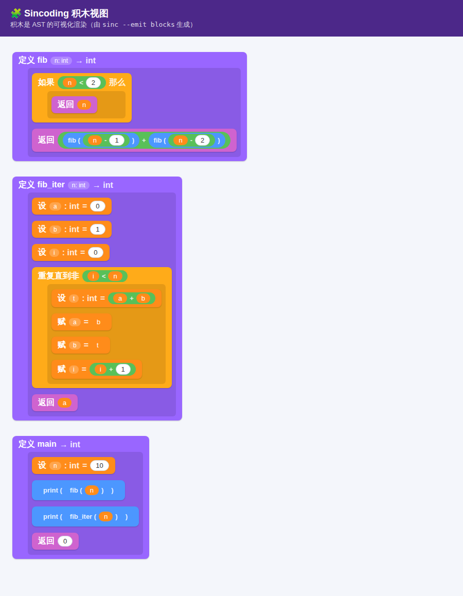

# Sincoding

类似 Scratch 的图形化编程工具：用户通过**积木**或**文本**编写程序，
程序使用自研语言（语法类似 Lua/Python），**转译为 C** 后编译为各平台原生应用。

> 完全自研 · imgui + Qt 编辑器 · raylib 运行时 · 多平台（Windows / Android / Web）

详细技术设计见 [`docs/DESIGN.md`](docs/DESIGN.md)，语言参考见 [`docs/LANGUAGE.md`](docs/LANGUAGE.md)。

---

## 当前进度

**整条技术栈已端到端打通**：一段 Sincoding 代码 → 转 C → 链接运行时 → raylib → 能用方向键移动角色的原生成品。

| 阶段 | 内容 | 状态 |
|---|---|---|
| 0 | **最小垂直切片**：语言 → C → raylib → 可运行的"方向键移动精灵"成品 | ✅ 已跑通（无头渲染验证，见下图） |
| 1 | 语言 → C 转译器（Lexer/Parser/类型检查/代码生成） | ✅ 已完成，斐波那契等用例可编译运行 |
| 2 | runtime.c 基于 raylib（舞台/精灵/输入/声音） | ✅ 运行时 + 桥接层落地，方块角色已渲染 |
| 3 | 积木编辑器接 AST（积木 ⇄ 文本双向同步） | 🚧 AST↔文本↔积木 序列化引擎 + 积木查看器已完成；拖拽编辑待做 |
| 4 | CMake 多平台（Windows → Web → Android） | ⏳ 规划中 |
| 5 | JSON 桥接外部 ELF（静态 + 动态） | ⏳ 规划中 |

核心设计原则：**AST 是唯一真相源**。积木是 AST 的可视化渲染，文本是 AST 的序列化。

阶段 0 成品截图（`examples/game.sin` 无头运行所得，角色为居中方块）：


积木视图（`examples/fib.sin` 经 `sinc --emit blocks` 渲染，积木即 AST 的可视化）：



---

## 快速开始

### 1. 构建编译器 `sinc`

```bash
cmake -S compiler -B compiler/build
cmake --build compiler/build -j
```

### 2. 把 Sincoding 源码转译为 C 并运行

```bash
# 转译为 C
./compiler/build/sinc examples/fib.sin -o fib.c

# 用任意 C 编译器编译运行
gcc fib.c -o fib && ./fib
# 输出:
# 55
# 55
```

也可以直接打印生成的 C（不带 `-o` 时输出到 stdout），或用 `--tokens` 查看词法结果。

### 3. 编出图形成品（需要 raylib）

通过 `extern fn` 声明的运行时函数（见 `runtime/prelude.h`），程序可以开窗口、画角色、读按键：

```bash
# 安装 raylib（Ubuntu 举例）后：
tools/build_native.sh examples/game.sin /tmp/game
/tmp/game        # 方向键移动方块角色
```

无显示器环境（CI）可无头运行并截图验证：

```bash
SIN_MAX_FRAMES=8 SIN_SCREENSHOT=shot.png \
  xvfb-run -a -s "-screen 0 800x600x24" /tmp/game
```

### 4. 跑测试

```bash
bash tests/run_tests.sh
```

端到端验证：源码 → 转译 → `gcc` 编译 → 运行 → 比对输出，并检查类型/语义错误能被正确拒绝。

---

## 语言一瞥

显式类型 + 局部类型推断，大括号风格：

```rust
fn fib(n: int) -> int {
    if n < 2 {
        return n
    }
    return fib(n - 1) + fib(n - 2)
}

fn main() -> int {
    let n = 10          // 推断为 int
    print(fib(n))       // 55
    return 0
}
```

支持：`int` / `float` / `bool`、函数（含递归/互递归）、`if/else`、`while`、
算术与逻辑运算、内建 `print`。完整文法见 [`docs/LANGUAGE.md`](docs/LANGUAGE.md)。

---

## 目录结构

```
compiler/        语言 → C 转译器（C++17，手写递归下降）
  include/       词法/语法/AST/类型检查/代码生成 头文件
  src/           对应实现 + sinc 命令行入口
runtime/         运行时：runtime.c（Scratch 风格，封装 raylib）
                 + prelude.c/.h（语言 ABI 桥接层，extern fn 的实现）
editor/          积木前端：block_viewer.html（Scratch 风格积木渲染器）
tools/           build_native.sh / render_blocks.sh / png_nonbg.py / screenshot.js
examples/        示例 .sin 程序（hello / fib / types / game）
tests/           端到端测试与用例
docs/            技术设计、语言参考、截图
```

## 三种视图，一个 AST

文本、积木、C 代码都从同一棵 AST 派生：

```bash
sinc examples/fib.sin --emit src      # AST → 规范化 Sincoding 源码（文本视图）
sinc examples/fib.sin --emit blocks   # AST → 积木模型 JSON（积木视图）
sinc examples/fib.sin --emit c        # AST → C 代码（编译产物）
```

`--emit src` 幂等且与原程序语义等价（往返后生成的 C 完全一致），这正是积木 ⇄ 文本双向同步的正确性基础。
