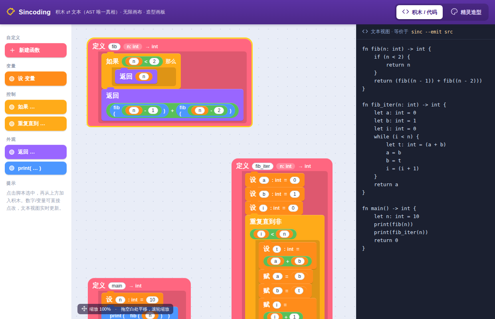
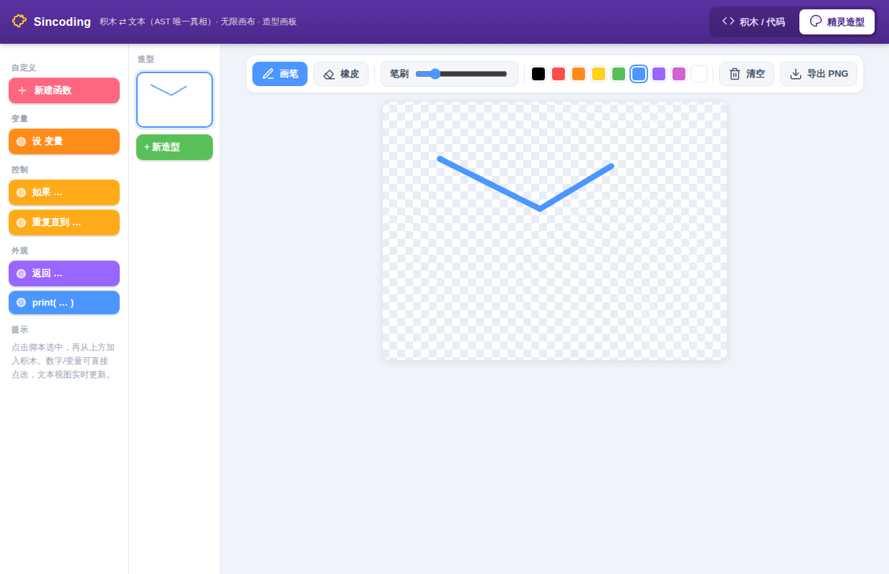
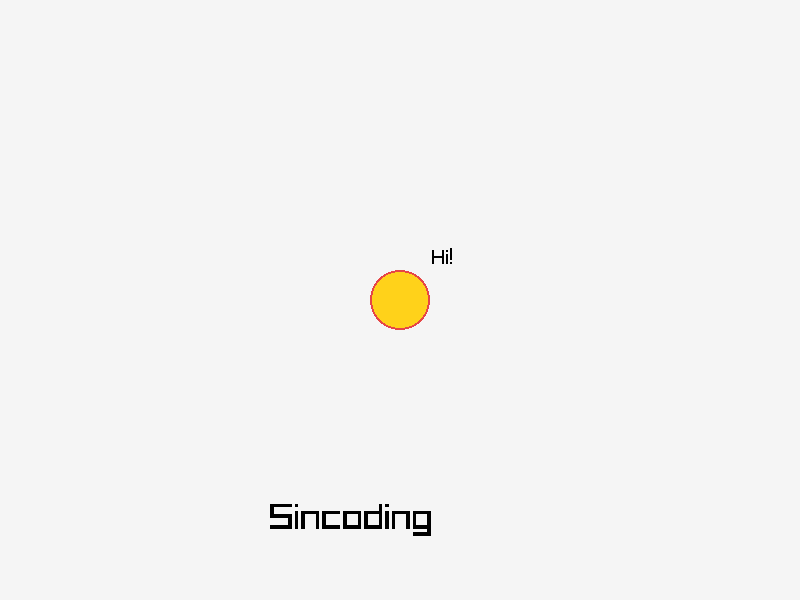
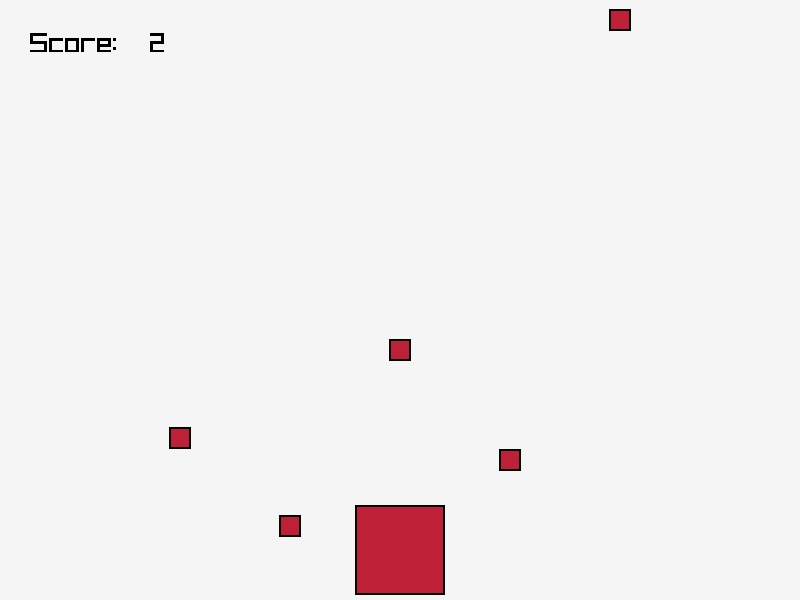
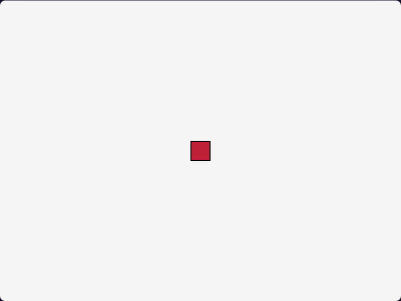
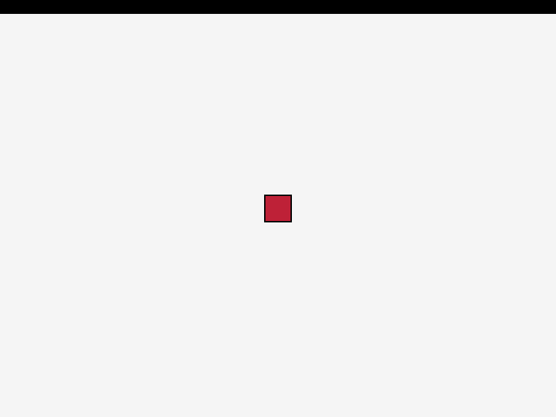

# Sincoding

类似 Scratch 的图形化编程工具：用户通过**积木**或**文本**编写程序，
程序使用自研语言（语法类似 Lua/Python），**转译为 C** 后编译为各平台原生应用。

> 完全自研 · imgui + Qt 编辑器 · raylib 运行时 · 多平台（Windows / Android / Web）

详细技术设计见 [`docs/DESIGN.md`](docs/DESIGN.md)，语言参考见 [`docs/LANGUAGE.md`](docs/LANGUAGE.md)。

---

## 当前进度

**整条技术栈已端到端打通**：一段 Sincoding 代码 → 转 C → 链接运行时 → raylib → 能用方向键移动角色的原生成品。

| 阶段 | 内容 | 状态 |
|---|---|---|
| 0 | **最小垂直切片**：语言 → C → raylib → 可运行的"方向键移动精灵"成品 | ✅ 已跑通（无头渲染验证，见下图） |
| 1 | 语言 → C 转译器（Lexer/Parser/类型检查/代码生成） | ✅ 已完成，斐波那契等用例可编译运行 |
| 2 | runtime.c 基于 raylib（舞台/精灵/输入/声音） | ✅ 运行时 + 桥接层落地，方块角色已渲染 |
| 3 | 积木编辑器接 AST（积木 ⇄ 文本双向同步） | 🚧 单页 IDE：无限画布 / 多精灵·多页积木 / 编辑写回 / **积木拖拽重排** / 造型画板 / **舞台（造型即纹理）**|
| 4 | CMake 多平台（Web → Windows → Android） | ✅ **Web(wasm) / Windows(.exe) / Android(.so) 三平台均打通**（iOS 按设计放弃） |
| 5 | JSON 桥接外部 ELF（静态 + 动态） | ✅ 静态链接 + 动态 dlopen/dlsym 均打通（含三层类型映射） |

> 设计文档的 6 个阶段（0–5）已全部落地，并各有可复现的验证（`tests/run_tests.sh`，共 24 项）。

核心设计原则：**AST 是唯一真相源**。积木是 AST 的可视化渲染，文本是 AST 的序列化。

阶段 0 成品截图（`examples/game.sin` 无头运行所得，角色为居中方块）：


积木 IDE（`editor/index.html`）：无限积木画布 + 实时文本写回（左边改积木，右边文本立即更新）：



精灵造型画板（画笔 / 橡皮 / 调色板 / 多造型）。底部精灵栏支持**多精灵**，每个精灵是独立的**一页积木**；积木可**拖拽重排**：



舞台：精灵以其「造型」为外观/纹理（下图左为占位、右为画板里画的造型），可拖动摆位：


字符串接入运行时：PNG 造型经 `sprite_load` 当纹理、`say` 气泡、`draw_text` 画文字（`examples/say.sin` 无头运行）：



**完整可玩小游戏「接球」**（`examples/catch.sin`）：方向键移动挡板接住下落小球。综合用到定长数组（小球句柄与坐标）、字符串/整数文字、键盘输入与计分逻辑。下图为无头运行 60 帧所得，`Score: 2` 证明计分逻辑确实在跑：



阶段 4：同一份 `game.sin` 转 C 后经 emscripten 编成 **WebAssembly**，在浏览器中由 raylib 渲染（最像 Scratch 的发布方式）：



阶段 4：同一份 `game.sin` 经 MinGW-w64 交叉编译出单文件 **Windows `.exe`**（下图为 Wine 中实跑，顶部黑条是 Wine 标题栏）：



---

## 快速开始

### 1. 构建编译器 `sinc`

```bash
cmake -S compiler -B compiler/build
cmake --build compiler/build -j
```

### 2. 把 Sincoding 源码转译为 C 并运行

```bash
# 转译为 C
./compiler/build/sinc examples/fib.sin -o fib.c

# 用任意 C 编译器编译运行
gcc fib.c -o fib && ./fib
# 输出:
# 55
# 55
```

也可以直接打印生成的 C（不带 `-o` 时输出到 stdout），或用 `--tokens` 查看词法结果。

### 3. 编出图形成品（需要 raylib）

通过 `extern fn` 声明的运行时函数（见 `runtime/prelude.h`），程序可以开窗口、画角色、读按键：

```bash
# 安装 raylib（Ubuntu 举例）后：
tools/build_native.sh examples/game.sin /tmp/game
/tmp/game        # 方向键移动方块角色
```

无显示器环境（CI）可无头运行并截图验证：

```bash
SIN_MAX_FRAMES=8 SIN_SCREENSHOT=shot.png \
  xvfb-run -a -s "-screen 0 800x600x24" /tmp/game
```

### 4. 跑测试

```bash
bash tests/run_tests.sh
```

端到端验证：源码 → 转译 → `gcc` 编译 → 运行 → 比对输出，并检查类型/语义错误能被正确拒绝。

---

## 语言一瞥

显式类型 + 局部类型推断，大括号风格：

```rust
fn fib(n: int) -> int {
    if n < 2 {
        return n
    }
    return fib(n - 1) + fib(n - 2)
}

fn main() -> int {
    let n = 10          // 推断为 int
    print(fib(n))       // 55
    return 0
}
```

支持：`int` / `float` / `bool` / `string`、**定长数组 `T[N]`**、**全局变量**、函数（含递归/互递归）、
`if/else`、`while`、**`for i in a..b`**、算术与逻辑运算、内建 `print`。完整文法见 [`docs/LANGUAGE.md`](docs/LANGUAGE.md)。

---

## 目录结构

```
compiler/        语言 → C 转译器（C++17，手写递归下降）
  include/       词法/语法/AST/类型检查/代码生成 头文件
  src/           对应实现 + sinc 命令行入口
runtime/         运行时：runtime.c（Scratch 风格，封装 raylib）
                 + prelude.c/.h（语言 ABI 桥接层，extern fn 的实现）
editor/          积木前端：单页 IDE（index.html，多精灵/多页/造型画板）
templates/       平台构建模板：web/（emscripten）、windows/（MinGW）、android/（NDK+Gradle）
tools/           build_native.sh / build_web.sh / render_blocks.sh / 各类验证脚本
examples/        示例 .sin 程序（hello / fib / types / game）
tests/           端到端测试与用例
docs/            技术设计、语言参考、截图
```

## 三种视图，一个 AST

文本、积木、C 代码都从同一棵 AST 派生：

```bash
sinc examples/fib.sin --emit src      # AST → 规范化 Sincoding 源码（文本视图）
sinc examples/fib.sin --emit blocks   # AST → 积木模型 JSON（积木视图）
sinc examples/fib.sin --emit c        # AST → C 代码（编译产物）
```

`--emit src` 幂等且与原程序语义等价（往返后生成的 C 完全一致），这正是积木 ⇄ 文本双向同步的正确性基础。

## 编成 Web(wasm) 成品

```bash
# 需要 emscripten（emcmake）+ raylib 的 web 静态库（/usr/local/lib/web/libraylib.a）
tools/build_web.sh examples/game.sin out_web
# wasm 不支持 file://，用 HTTP 服务器打开：
python3 -m http.server 8000 --directory out_web   # 浏览器访问 http://localhost:8000
```

由 `templates/web/`（emscripten shell + CMakeLists）经 `emcmake cmake` 构建，
主循环用 `-sASYNCIFY` 适配浏览器。

## 编成 Windows .exe（MinGW 交叉编译）

```bash
# 需要 MinGW-w64 + raylib 的 Windows 静态库（/usr/local/lib/win/libraylib.a）
tools/build_windows.sh examples/game.sin out/game.exe   # 产出单文件 PE32+ exe
```

由 `templates/windows/`（MinGW 工具链文件 + CMakeLists）交叉编译，`-static` 链接出免依赖单文件。

## 打包 Android（NDK + Gradle 壳）

```bash
# 1) NDK 交叉编译原生库（需 Android NDK + raylib 的 Android 静态库）
ANDROID_NDK=/usr/lib/android-ndk \
  tools/build_android.sh examples/game.sin templates/android/jniLibs/arm64-v8a/libsincoding.so
# 产物为 arm64 ELF 共享库，导出 ANativeActivity_onCreate（系统入口）→ 调用程序 main

# 2) 套 APK 壳（需 Android SDK + Gradle，模板见 templates/android/）
```

native 库直接以 NDK clang 链接 raylib(Android) 产出，可验证为 AArch64 的
NativeActivity `.so`；外层 APK 由 `templates/android/`（Manifest + Gradle）打包。

## 桥接外部 ELF（JSON 接口定义）

用一份 JSON 描述外部 C 库的接口，自动生成语言侧 `extern fn` 声明与 C 胶水，
支持**静态链接**与**动态 dlopen/dlsym**两种方式；并维护
JSON 类型 ↔ 语言类型 ↔ C 类型 的映射（例如语言 `int`=`long long` ABI，
桥接层会转换为外部库真实的 C `int`）。

```bash
# 静态链接
tools/build_with_bridge.sh examples/bridge/use_motor.sin examples/bridge/motor.json out/motor
out/motor                                  # 调用外部 motor 模块

# 动态加载（dlopen）
tools/build_with_bridge.sh examples/bridge/use_motor.sin examples/bridge/motor_dyn.json out/motor_dyn
LD_LIBRARY_PATH=out out/motor_dyn
```

JSON 定义见 [`examples/bridge/motor.json`](examples/bridge/motor.json)，生成器为 `tools/sin_bridge.py`。
