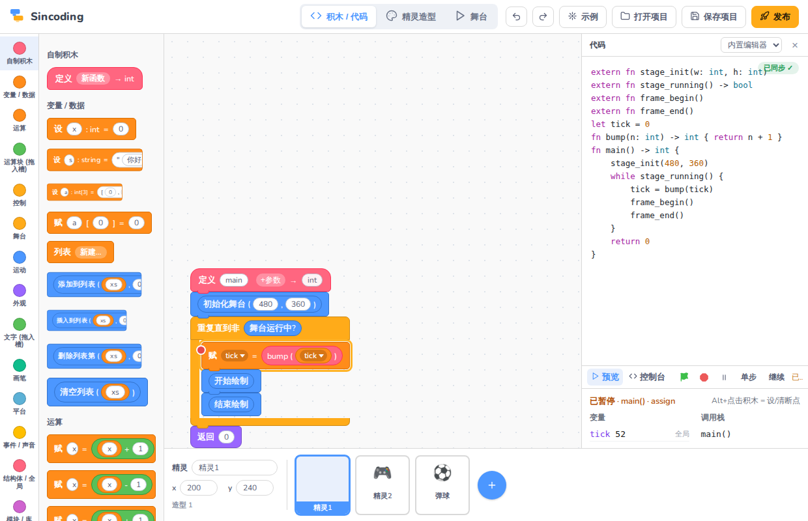
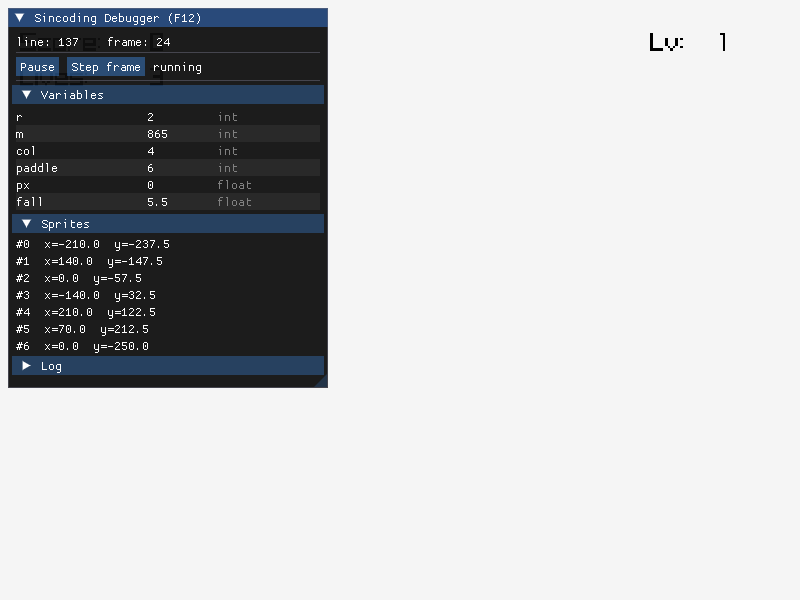
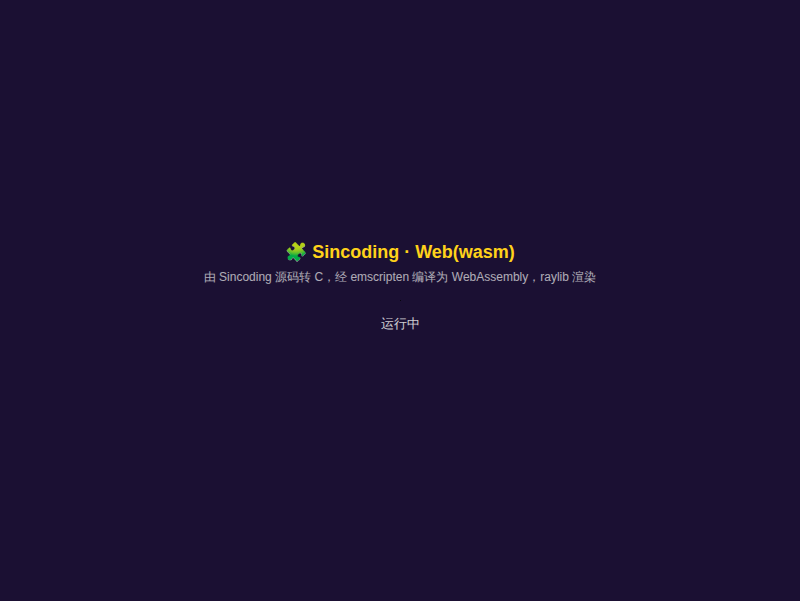

# 从积木到原生 exe：Sincoding 全链路走一遍

Sincoding 是一门**静态类型的小语言 + 图形化编辑器**：用积木或文本写程序，
经自研编译器转成 C，再编成各平台**原生成品**（Windows / Web / Linux / Android）。

它和 Scratch 最大的不同：Scratch 在浏览器里**解释运行**，做不出独立成品；
Sincoding 是**真编译**——同一份程序能出可玩的网页 wasm、也能出原生 `.exe`。

---

## 1. 一张图看懂链路

```
积木  ⇄  文本            ← 编辑期（AST 唯一真相，双向同步）
  └──────┘
      │ AST
      ▼
  自研编译器 (C++)：Lexer → Parser → 类型检查 → 生成 C
      │
      ├─ 预览：interp.js 浏览器内解释（编辑即跑）
      │
      ▼  生成的 C  +  runtime（raylib 封装）
  ┌──────────┬──────────┬──────────────┬──────────┐
  │ Linux    │ Windows  │ Web(wasm)    │ Android  │
  │ 原生二进制 │  .exe    │ .html+.wasm  │  .apk    │
  └──────────┴──────────┴──────────────┴──────────┘
```

**核心原则**：AST 是唯一真相，积木是它的可视化渲染，文本是它的序列化，二者绝不直接互转。

---

## 2. 以 guardian 小游戏为例

「家园守护者」：方向键移动挡板，接金币(+分)、躲炸弹(-命)。
源码 [`examples/guardian.sin`](../examples/guardian.sin)。

### 2.1 用「正经结构」建模

把一个下落物的完整状态聚成结构体，用**结构体数组**存所有下落物
（而不是几个平行的全局数组）：

```rust
struct Faller {
    x: float,
    y: float,
    kind: int,        // 0=金币 1=炸弹
    handle: int
}

let fallers: Faller[6]           // 结构体数组 = "敌人列表"

// 结构体作参数 + 返回值（值语义：按值拷贝，无别名坑）
fn respawn(f: Faller, seed: int) -> Faller {
    f.x = spawn_x(seed)
    f.y = 280.0
    return f
}
fn caught(f: Faller, px: float) -> bool {
    return abs_f(f.x - px) < 60.0
}
```

主循环用「取出 → 改 → 放回」处理每个下落物：

```rust
for i in 0..N {
    let f = fallers[i]           // 取出（值拷贝）
    f.y = f.y - fall
    if f.y < -240.0 {
        if caught(f, px) {
            if f.kind == 0 { game.score = game.score + 1 }
            if f.kind == 1 { game.lives = game.lives - 1 }
        }
        f = respawn(f, game.score + i * 3 + game.level)
    }
    sprite_move_to(f.handle, f.x, f.y)
    fallers[i] = f               // 放回
}
```

### 2.2 编辑期：积木 ⇄ 文本 + 真 IDE

编辑器里左边拖积木、右边同步显示等价文本（`sinc --emit src` 逐字节一致）。
下图是「示例 → 接金币」模板：事件帽（当 ⚑ 被点击 / 每一帧）驱动，右下预览即时在跑：


IDE 具备 Scratch 没有的「真编程」能力：

- **事件帽 + 示例模板**：拖一顶「当 ⚑ 被点击」帽子就能开写（没有 main 也能跑，
  编译器自动合成主循环）；顶栏「示例」一键载入弹弹球/接金币等模板起步
- **悬停/光标显示类型**：光标停在 `fallers` 上，状态栏显示 `变量 fallers : Faller[6]`
- **查找引用 / F2 重命名**：改 `Faller` 名字，所有类型标注/字面量一起改；
  改局部变量只影响当前函数（作用域正确）
- **补全 + 类型诊断**：引擎按语境给候选（成员字段 / 类型位置 / 作用域内变量带真实
  类型），类型不匹配即时报错、点击选中出错标识符
- **积木级调试器**：`Alt+点击`积木设断点（红点），命中即暂停并高亮当前积木，
  面板显示变量值与调用栈，可单步/继续——「看着自己的程序一块一块地跑」
- **注释保真 + 撤销/重做 + 积木复制**：文本里写的 `//` 注释在积木编辑后原样保留；
  Ctrl+Z/Ctrl+Y 全量撤销重做；Ctrl+拖拽复制积木、右键函数头复制整个函数
- **函数签名在积木上可编辑**：函数头点「+参数」加参数，参数名/类型可点改
  （类型写 `int` / `float[3]` / `int[]`），右键删参数，返回类型同样可改；
  泛型 `<T>` 也显示并可编辑——语言的类型能力在积木侧同样可达，不必回到文本
- **模块 / 库 / .sinlib 库包**：调色板「导入库…」可视化添加 `import`，导入后该库
  积木自动出现；「库管理…」可安装单文件 `.sinlib` 库包（随 `.sinproj` 项目保存，
  发布时自动带给编译器）
- **结构体 / 全局变量 / 列表也是积木**：调色板可新建；结构体积木上点「+字段」
  加字段——§2.1 里 `Faller` 那套建模，全程不用回到文本
- **代码面板可关闭 / 可换 CodeMirror**：右上角 × 收起纯积木使用；编辑器可切换成
  CodeMirror（行号/括号匹配，补全与 F2 仍由引擎驱动）



编出来的**原生成品里也有调试面板**（`tools/build_native.sh --debug`，按 F12 呼出）：
当前源码行、变量监视、暂停/逐帧、精灵检查器。发布构建不含这些，零开销。



### 2.3 编译发布

**工具链不用你自己准备**，一条命令装齐（已装过的自动跳过）：

```bash
tools/setup_toolchains.sh          # native/web/windows/android/sdk 全装
tools/setup_toolchains.sh --check  # 只看各目标是否就绪
```

之后直接构建即可——不需要 `source emsdk_env.sh`，也不需要 `export ANDROID_NDK`，
构建脚本会自己发现并激活工具链：

```bash
# 先构建编译器
cmake -S compiler -B compiler/build && cmake --build compiler/build

# 原生 Linux
tools/build_native.sh examples/guardian.sin out/guardian

# Web(wasm)；末参数是造型资源目录（随 wasm 预载打包）
tools/build_web.sh examples/guardian.sin out/guardian-web examples/assets/guardian

# Windows .exe
tools/build_windows.sh examples/guardian.sin out/guardian.exe

# Android：可直接 adb install 的签名 APK（造型随 assets 入包）
tools/build_apk.sh examples/guardian.sin out/guardian.apk Guardian
# 只要原生库时：tools/build_android.sh examples/guardian.sin out/libsincoding.so
```

**四端成品均已端到端验证**（`tests/run_tests.sh`，缺工具链则跳过）：

| 目标 | 产物 | 验证方式 |
|---|---|---|
| Linux | 原生二进制 | 无头 raylib 渲染 + 计分逻辑 |
| Web | `.html + .wasm + .data` | Chromium 渲染截图（含造型预载） |
| Windows | `.exe` | PE32+ MS Windows 可执行 |
| Android | 签名 `.apk` | `aapt2` 解析 Manifest + arm64 原生库 + `apksigner` 验签 |

编辑器里也可以「一键发布」弹窗勾选平台；**单文件 HTML** 目标完全在浏览器内生成
（内联解释器 + 程序 + 造型），双击即玩、免任何工具链。

### 2.4 成品：网页里真的在跑

guardian 编成 WebAssembly 后在浏览器里的真实画面——造型 PNG 随包加载，
金币/炸弹下落、挡板、计分板全部正常：



---

## 3. 语言能力速览

| 类别 | 支持 |
|---|---|
| 类型 | `int / float / bool / string / void`、结构体、定长数组 `T[N]`、切片 `T[]`、列表 `T[*]`、泛型 `<T>` |
| 聚合 | 数组/结构体作参数、返回值、整体赋值（值语义）；结构体数组、嵌套字段；下标全带越界检查（报行号） |
| 列表 | 全局 `T[*]`：`push/pop/insert/remove_at/clear/len`，可借用为切片复用 `std/arrayx` |
| 字符串 | 拼接 `+`、比较、`str(x)`；内建库按 UTF-8 码点：`str_len/str_at/str_sub/str_find/str_contains/str_to_int/str_to_float` |
| 事件 | `on_start / on_frame / on_key_* / on_click`——无 main 自动合成主循环（预览与成品同序） |
| 数学 | libm 直接 `extern fn` 声明可用（`sqrt/sin/cos/fmin/fmax/...`） |
| 运行时 | 舞台/精灵/造型/显隐/边缘反弹/键鼠(含边沿)/计时器/画笔/声音/广播/碰撞 |
| 生态 | 内置 `std/mathx` `std/arrayx` `std/stage`；`.sinlib` 单文件库包（`tools/sinlib.py` 打包/解包） |
| 互操作 | `extern fn` FFI + JSON 桥接外部 ELF（静态 / dlopen 动态） |

完整语言参考见 [`docs/LANGUAGE.md`](LANGUAGE.md)，方向与架构见 [`docs/ROADMAP.md`](ROADMAP.md)。

---

## 4. 端到端测试

`tests/run_tests.sh` 覆盖整条流水线：源码 → C → 编译 → 运行 → 比对输出，
含序列化幂等、积木往返、类型错误反例、原生/Web 无头渲染、IDE 交互（Chromium）、
mini-LSP（hover/rename）等。缺工具链的阶段自动跳过。

```bash
bash tests/run_tests.sh
```
